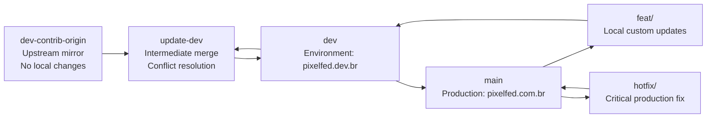

<picture>
  <source media="(prefers-color-scheme: dark)" srcset="https://pixelfed.nyc3.cdn.digitaloceanspaces.com/logos/pixelfed-full-color-dark.svg">
  <source media="(prefers-color-scheme: light)" srcset="https://pixelfed.nyc3.cdn.digitaloceanspaces.com/logos/pixelfed-full-color.svg">
  
</picture>

# Pixelfed Branch Workflow

This repository follows a branch flow to keep upstream updates, integration, development, and production separated and stable.

## Branch Roles

- `dev-contrib-origin`: Always synchronized with upstream Pixelfed. No local custom changes should be committed here.
- `update-dev`: Intermediate integration branch. It receives `dev` and merges with `dev-contrib-origin`, resolving possible conflicts.
- `dev`: Development branch associated with https://pixelfed.dev.br.
- `main`: Production branch used to publish https://pixelfed.com.br.
- `feat/<feature-name>`: Branch for local updates that do not come from upstream. It must be merged into `dev`.
- `hotfix/<name>`: Branch for urgent production fixes. Direct merge to `main` is allowed only for this case.

## Pixelfed Update Flow

## Recommended Update Process

1. Update `dev-contrib-origin` from upstream Pixelfed.
2. Merge `dev` into `update-dev`.
3. Merge `dev-contrib-origin` into `update-dev`.
4. Resolve conflicts in `update-dev` and validate the application.
5. Merge `update-dev` back into `dev`.
6. After validation on `dev` (`pixelfed.dev.br`), promote changes to `main` (`pixelfed.com.br`).

## Local Changes and Merge Policy

1. Every new local change starts from `main`, using either `feat/<feature-name>` or `hotfix/<name>`.
2. Any local update that does not come from upstream must be developed in a `feat/<feature-name>` branch and merged into `dev`.
3. Direct merges into `main` are not allowed during normal development.
4. Direct merges into `main` are allowed only for urgent `hotfix/<name>` branches that fix problematic production updates.

## Quick Links

- Stable (production): https://github.com/eufelipemateus/pixelfed/tree/main
- Development: https://github.com/eufelipemateus/pixelfed/tree/dev
